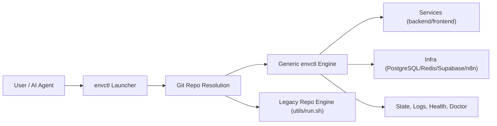

# envctl

`envctl` is a global CLI that brings up complete local development environments across your main repo and multiple worktrees in seconds.

It is designed for modern AI-assisted development: run several implementations in parallel, test them side-by-side, and compare results without hand-wiring scripts per repository.

## Table of Contents
- [What envctl Solves](#what-envctl-solves)
- [Why This Matters for AI Coding](#why-this-matters-for-ai-coding)
- [Core Capabilities](#core-capabilities)
- [How envctl Works](#how-envctl-works)
- [Install Globally](#install-globally)
- [Repository Detection and Engine Routing](#repository-detection-and-engine-routing)
- [Quick Start](#quick-start)
- [Run/Test/Compare Playbooks](#runtestcompare-playbooks)
- [Command Reference](#command-reference)
- [Configuration Model](#configuration-model)
- [Configuration Reference (Grouped by Type)](#configuration-reference-grouped-by-type)
- [Optional Hooks (`.envctl.sh`)](#optional-hooks-envctlsh)
- [Troubleshooting](#troubleshooting)
- [Legacy Compatibility](#legacy-compatibility)

## What envctl Solves
When you are building quickly across many branches or worktrees, local environment setup is usually the bottleneck.

Typical pain points:
- Every repo has different startup assumptions.
- Running multiple implementations at once causes port and process collisions.
- Comparing implementations means manually juggling shells and infrastructure.
- AI agents can generate code fast, but they still need deterministic run/test loops.

`envctl` solves this by standardizing orchestration into one CLI and one model.

## Why This Matters for AI Coding
AI workflows work best when environment control is deterministic.

With `envctl`, you can:
- Spin up many worktrees fast with isolated ports.
- Run the same tests against multiple implementations.
- Keep infra policy (PostgreSQL/Redis/Supabase/n8n) consistent across all trees.
- Use one command vocabulary for humans and agents.

This makes parallel agent execution practical instead of fragile.

## Core Capabilities
- Global launcher: call `envctl` from any git project.
- Worktree orchestration: start, resume, inspect, and clean up multi-tree sessions.
- Full stack startup: backend, frontend, and infrastructure in one flow.
- Infrastructure toggles by scope:
  - Global
  - Main only
  - All trees
  - Selected trees via filters
- Health, logs, doctor diagnostics, and stateful resume.
- Legacy forwarding for existing `utils/run.sh` projects.

## How envctl Works
`envctl` has a launcher layer and an engine layer:



## Install Globally
From this repository:

```bash
./bin/envctl install
```

Useful variants:

```bash
envctl install --shell-file ~/.zshrc
envctl install --shell-file ~/.bashrc
envctl install --dry-run
```

Uninstall:

```bash
envctl uninstall
envctl uninstall --shell-file ~/.zshrc
```

Verify:

```bash
envctl --help
envctl doctor --repo /absolute/path/to/repo
```

## Repository Detection and Engine Routing
A path is considered valid when it is a git repository root (`.git` directory or `.git` file).

This means `.envctl.sh` is not required just to run `envctl`.

Routing order:
1. If `.envctl` or `.envctl.sh` exists: use the generic envctl engine.
2. Else if `utils/run_engine.sh` or `utils/run.sh` exists: forward to legacy engine.
3. Else: use the generic envctl engine with defaults.

You can run:
- From any subdirectory inside a repo (auto root detection)
- From anywhere with `--repo <path>`

## Quick Start

### 1. (Optional) add orchestration config

```bash
cp .envctl.example /path/to/your-project/.envctl
```

### 2. Define services (optional but recommended)

```bash
# .envctl
ENVCTL_SERVICE_1="API Server | backend  | backend  | 8000 |      | logs/api"
ENVCTL_SERVICE_2="Web App    | frontend | frontend | 3000 | 8000 | logs/web"
```

Service format:

```text
"DisplayName | DirectoryPath | ServiceType | Port | BackendPort | LogDirectory"
```

### 3. Start environment

```bash
envctl --resume
```

### 4. Operate it

```bash
envctl dashboard
envctl logs --all --logs-follow
envctl test --all
envctl stop-all
```

## Run/Test/Compare Playbooks

### Playbook 1: Parallel implementation run
Run multiple worktree implementations in one orchestrated session:

```bash
envctl plan
envctl dashboard
```

Use dashboard + logs to inspect each implementation while they run concurrently.

### Playbook 2: Compare behavior across implementations
1. Start session for all selected trees.
2. Run a shared test target.
3. Compare failing/passing trees from one control plane.

Example:

```bash
envctl test --all
envctl errors --all
envctl logs --all
```

### Playbook 3: Validate one project repeatedly while AI iterates

```bash
envctl test --project api
envctl logs --project api --logs-follow
envctl restart --project api
```

### Playbook 4: Multi-repo AI control from one terminal

```bash
envctl --repo ~/projects/service-a --resume
envctl --repo ~/projects/service-b --resume
envctl --repo ~/projects/service-c --resume
```

## Command Reference

### Launcher commands

```text
envctl [--repo <path>] [engine args...]
envctl doctor [--repo <path>]
envctl install [--shell-file <path>] [--dry-run]
envctl uninstall [--shell-file <path>] [--dry-run]
envctl --help
```

`envctl doctor` validates launcher routing (binary path, repo root, selected engine).

### Engine command families
List at runtime:

```bash
envctl --list-commands
envctl --list-targets
```

Common commands:
- `dashboard`
- `delete-worktree`
- `stop` / `stop-all`
- `restart`
- `test`
- `logs`
- `health`
- `errors`
- `doctor`
- `pr`
- `commit`

Common targeting/mode options:
- `--main`
- `--resume`
- `--project`
- `--service`
- `--all`
- `--doctor`
- `--debug-trace`
- `--parallel-trees`
- `--parallel-trees-max`

## Configuration Model

### Config files
- `.envctl` (recommended): declarative orchestration config.
- `.envctl.sh` (optional): shell hooks for advanced custom orchestration.

### Precedence
`envctl` applies configuration in this order:
1. Existing shell environment variables
2. `.envctl` / `.envctl.sh`
3. Engine defaults

### `.envctl` vs `.env`
- `.envctl` controls orchestration behavior.
- `.env` controls application runtime env vars/secrets.

Keep them separate for predictable startup and safer secret handling.

## Configuration Reference (Grouped by Type)

### Core
| Variable | Default | Purpose |
| --- | --- | --- |
| `ENVCTL_SKIP_DEFAULT_INFRASTRUCTURE` | `false` | Global skip for built-in PostgreSQL and Redis startup. |
| `ENVCTL_CONFIG_FILE` | unset | Explicit path to config file. |

### Database (PostgreSQL and Supabase)
Supabase includes PostgreSQL, so treat them as alternative stacks per scope.

| Variable | Default | Purpose |
| --- | --- | --- |
| `POSTGRES_MAIN_ENABLE` | `true` | Enable PostgreSQL for Main mode. |
| `DB_PORT` | `5432` | PostgreSQL base port. |
| `DB_USER` | `postgres` | PostgreSQL user. |
| `DB_PASSWORD` | `postgres` | PostgreSQL password. |
| `DB_NAME` | `postgres` | PostgreSQL DB name. |
| `SUPABASE_MAIN_ENABLE` | `false` | Enable Supabase stack for Main mode. |
| `SUPABASE_ALL_TREES` | `false` | Enable Supabase stack for all trees. |
| `SUPABASE_TREE_FILTER` | empty | Comma-separated features that should use Supabase. |

### Redis
| Variable | Default | Purpose |
| --- | --- | --- |
| `REDIS_ENABLE` | `true` | Global Redis switch (Main + Trees). |
| `REDIS_MAIN_ENABLE` | `true` | Redis switch for Main mode. |
| `REDIS_ALL_TREES` | `true` | Enable Redis in all tree workspaces. |
| `REDIS_TREE_FILTER` | empty | Comma-separated features that should use Redis. |
| `REDIS_PORT` | `6379` | Redis base port. |

### n8n
| Variable | Default | Purpose |
| --- | --- | --- |
| `N8N_ENABLE` | `true` | Global n8n switch (Main + Trees). |
| `N8N_MAIN_ENABLE` | `false` | Enable n8n for Main mode. |
| `N8N_ALL_TREES` | `false` | Enable n8n for all trees. |
| `N8N_TREE_FILTER` | empty | Comma-separated features that should use n8n. |
| `N8N_PORT_BASE` | `5678` | n8n base port. |

### Backend
| Variable | Default | Purpose |
| --- | --- | --- |
| `RUN_BACKEND` | `true` | Enable backend auto-discovery. |
| `BACKEND_DIR_NAME` | `backend` | Preferred backend directory name. |
| `BACKEND_PORT_BASE` | `8000` | Backend base port for allocation. |

### Frontend
| Variable | Default | Purpose |
| --- | --- | --- |
| `RUN_FRONTEND` | `true` | Enable frontend auto-discovery. |
| `FRONTEND_DIR_NAME` | `frontend` | Preferred frontend directory name. |
| `FRONTEND_PORT_BASE` | `9000` | Frontend base port for allocation. |

### Explicit Services
| Variable | Default | Purpose |
| --- | --- | --- |
| `ENVCTL_SERVICE_<N>` | empty | Declared service list. If present, auto-discovery is disabled. |

## Optional Hooks (`.envctl.sh`)
Use this only when declarative config is not enough.

Available hooks:
- `envctl_define_services`
- `envctl_setup_infrastructure`

Example:

```bash
# .envctl.sh
envctl_setup_infrastructure() {
  echo "Custom infra bootstrap"
}

envctl_define_services() {
  start_service_with_retry "API" "$BASE_DIR/backend" "backend" "8000" "" "$LOGS_DIR/api"
  start_service_with_retry "Web" "$BASE_DIR/frontend" "frontend" "3000" "8000" "$LOGS_DIR/web"
}
```

You do not need `.envctl.sh` for normal usage.

## Troubleshooting

### "Could not resolve repository root"
- Ensure the path is a git repository root (`.git` dir or file).
- Or pass `--repo /absolute/path`.

### Port collisions or stale state
- Run `envctl --doctor`.
- Use `envctl --clear-port-state` when needed.
- Adjust base ports in `.envctl`.

### Unexpected services started
- If `ENVCTL_SERVICE_<N>` exists, auto-discovery is disabled.
- Remove/fix explicit service entries.

### Infra not starting as expected
Verify toggles for:
- `ENVCTL_SKIP_DEFAULT_INFRASTRUCTURE`
- PostgreSQL/Supabase toggles
- `REDIS_*`
- `N8N_*`

## Legacy Compatibility
If a repo is still based on `utils/run.sh`, `envctl` can forward commands there.

This enables gradual migration: keep old repos operational while adopting unified `envctl` orchestration for new and upgraded repos.

---

`envctl` is a development control plane for high-speed iteration: bring up full environments quickly, run many worktrees in parallel, and compare implementations with one consistent CLI.
