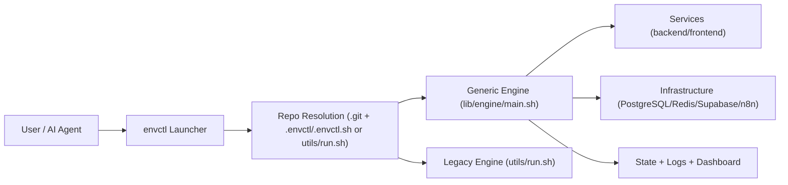

# envctl

`envctl` is a unified local-environment control plane for modern software teams.
It turns ad-hoc "run this script here, then that script there" into a consistent, reproducible CLI that works across repositories, worktrees, and AI-assisted coding sessions.

When you are programming with AI agents, the bottleneck is usually environment management, not code generation. `envctl` is built to remove that bottleneck.

## Table of Contents
- [Why envctl](#why-envctl)
- [What You Get](#what-you-get)
- [AI-First Workflow Benefits](#ai-first-workflow-benefits)
- [How It Works](#how-it-works)
- [Installation](#installation)
- [Repository Detection and Routing](#repository-detection-and-routing)
- [Quick Start](#quick-start)
- [Command Reference](#command-reference)
- [Configuration Model](#configuration-model)
- [Configuration Reference](#configuration-reference)
- [Programmable Hooks (`.envctl.sh`)](#programmable-hooks-envctlsh)
- [AI and Multi-Repository Playbooks](#ai-and-multi-repository-playbooks)
- [Runtime State, Logs, and Recovery](#runtime-state-logs-and-recovery)
- [Troubleshooting](#troubleshooting)
- [Legacy Compatibility](#legacy-compatibility)

## Why envctl
Local development at scale breaks down for predictable reasons:
- Every project has a different startup script and assumptions.
- Running several repositories in parallel causes port collisions and process drift.
- Worktrees multiply coordination overhead.
- AI agents can edit code quickly but still need deterministic environments to validate changes.

`envctl` solves this by standardizing environment orchestration while preserving project-level flexibility.

## What You Get
- One launcher command (`envctl`) from anywhere.
- Automatic repository root detection.
- Declarative project config (`.envctl`) and programmable hooks (`.envctl.sh`).
- Intelligent process orchestration for backend/frontend services.
- Built-in infra controls (PostgreSQL, Redis, Supabase, n8n).
- Parallel worktree startup and targeted project/service commands.
- Runtime dashboards, health checks, logs, and recovery flows.
- Backward compatibility with legacy `utils/run.sh` repositories.

## AI-First Workflow Benefits
`envctl` is particularly strong when coding with AI agents (Codex, Claude, Cursor, etc.) because it gives agents a stable execution model.

### 1. Deterministic environment handoff
You can ask an agent to run tests, restart services, or inspect logs without explaining custom scripts each time.

### 2. Multi-repository operation
Use `--repo` to control different projects from one terminal context:

```bash
envctl --repo ~/projects/service-a --resume
envctl --repo ~/projects/service-b --resume
envctl --repo ~/projects/service-c test --all
```

### 3. Worktree-native iteration
For parallel feature work, `envctl` can plan/start worktrees and keep per-worktree ports aligned.

### 4. Faster debug loops
Unified commands for logs, tests, restart, and diagnostics reduce instruction overhead between you and AI.

## How It Works
`envctl` has three layers:

1. Launcher layer (`bin/envctl`, `lib/envctl.sh`)
- Resolves project root (`.git` + `.envctl`/`.envctl.sh` or legacy `utils/run.sh`).
- Routes commands to either the generic engine or a legacy repository engine.

2. Engine layer (`lib/engine/main.sh`)
- Parses orchestration commands/options.
- Manages processes, ports, runtime state, dashboards, and infra.

3. Project config layer
- `.envctl`: declarative key/value orchestration config.
- `.envctl.sh`: optional programmable hooks for custom service/infra logic.



## Installation

### Install the CLI on your PATH
From this repository:

```bash
./bin/envctl install
```

`install` writes an idempotent PATH block to your shell startup file.
Use explicit target file if needed:

```bash
envctl install --shell-file ~/.zshrc
envctl install --shell-file ~/.bashrc
envctl install --dry-run
```

### Uninstall

```bash
envctl uninstall
envctl uninstall --shell-file ~/.zshrc
```

### Verify

```bash
envctl --help
envctl doctor --repo /absolute/path/to/repo
```

## Repository Detection and Routing
`envctl` considers a path a valid repo root when:
- `.git/` exists
- and one of the following exists:
  - `.envctl`
  - `.envctl.sh`
  - `utils/run.sh` (legacy mode)

Behavior:
- If `.envctl` or `.envctl.sh` exists: use the generic envctl engine.
- Otherwise, if `utils/run.sh` or `utils/run_engine.sh` exists: forward to legacy engine.

You can run from:
- Any subdirectory inside a detected repo (auto-detected root)
- Any location with explicit `--repo <path>`

## Quick Start

### 1. Create project config

```bash
cp .envctl.example /path/to/your-project/.envctl
```

### 2. Define services (declarative mode)

```bash
# .envctl
ENVCTL_SERVICE_1="API Server | backend  | backend  | 8000 |      | logs/api"
ENVCTL_SERVICE_2="Web App    | frontend | frontend | 3000 | 8000 | logs/web"
```

Service format:

```text
"DisplayName | DirectoryPath | ServiceType | Port | BackendPort | LogDirectory"
```

Supported `ServiceType` values:
- `backend`
- `frontend`

### 3. Start your environment

```bash
envctl
```

### 4. Common follow-up actions

```bash
envctl --resume
envctl logs --all --logs-follow
envctl tests --all
envctl stop-all
```

## Command Reference

### Launcher-level commands
These are handled directly by `envctl`:

```text
envctl [--repo <path>] [engine args...]
envctl doctor [--repo <path>]
envctl install [--shell-file <path>] [--dry-run]
envctl uninstall [--shell-file <path>] [--dry-run]
envctl --help
```

### Doctor note
- `envctl doctor` checks launcher resolution (binary path, repo root, engine path).
- `envctl --doctor` is forwarded to the engine and runs runtime diagnostics.

### Engine command families (forwarded)
The engine supports a broad command set. Use this for live discovery:

```bash
envctl --list-commands
envctl --list-targets
```

High-value commands:
- `plan`, `parallel-plan`, `sequential-plan`
- `dashboard`
- `delete-worktree`
- `stop`, `stop-all`, `blast-all`
- `restart`
- `test` / `tests`
- `logs`
- `pr` / `prs`
- `commit`
- `errors`

High-value options:
- Topology and mode: `--main`, `trees=true|false`, `--resume`, `--batch`
- Targeting: `--project`, `--projects`, `--service`, `--all`
- Performance: `--fast`, `--refresh-cache`, `--parallel-trees`, `--parallel-trees-max`
- Diagnostics: `--doctor`, `--debug-trace`, `--clear-port-state`
- Main service mode: `--main-services-local`, `--main-services-remote`

## Configuration Model

### Config file types
- `.envctl` (recommended): declarative key/value orchestration file.
- `.envctl.sh`: shell script with hook functions for custom orchestration.

### Precedence
Configuration follows:
1. Environment variables already set in shell
2. `.envctl` / `.envctl.sh`
3. Engine defaults

This means CI shells and AI sessions can override behavior without editing repo config.

### `.env` vs `.envctl`
- `.envctl` controls orchestration behavior.
- `.env` files control application runtime variables.

Keep orchestration and app secrets/config separate for predictability.

## Configuration Reference
This section mirrors the current grouped model and defaults.

### Core
| Variable | Default | Purpose |
| --- | --- | --- |
| `ENVCTL_SKIP_DEFAULT_INFRASTRUCTURE` | `false` | Global off-switch for built-in PostgreSQL/Redis startup. |
| `ENVCTL_CONFIG_FILE` | unset | Optional explicit path to config file. |

### Database (PostgreSQL / Supabase)
| Variable | Default | Purpose |
| --- | --- | --- |
| `POSTGRES_MAIN_ENABLE` | `true` | Enable shared Main-mode PostgreSQL. |
| `DB_PORT` | `5432` | PostgreSQL base port. |
| `DB_USER` | `postgres` | PostgreSQL user for default/local workflows. |
| `DB_PASSWORD` | `postgres` | PostgreSQL password for default/local workflows. |
| `DB_NAME` | `postgres` | PostgreSQL database name for default/local workflows. |
| `SUPABASE_MAIN_ENABLE` | `false` | Enable Supabase for Main mode. |
| `SUPABASE_ALL_TREES` | `false` | Enable Supabase for all tree workspaces. |
| `SUPABASE_TREE_FILTER` | empty | Comma-separated feature names to enable Supabase for selected trees. |

### Redis
| Variable | Default | Purpose |
| --- | --- | --- |
| `REDIS_ENABLE` | `true` | Global Redis switch for Main + Trees. |
| `REDIS_MAIN_ENABLE` | `true` | Enable Redis for Main mode. |
| `REDIS_ALL_TREES` | `true` | Enable Redis for all trees. |
| `REDIS_TREE_FILTER` | empty | Comma-separated feature names to enable Redis for selected trees. |
| `REDIS_PORT` | `6379` | Redis base port. |

### n8n
| Variable | Default | Purpose |
| --- | --- | --- |
| `N8N_ENABLE` | `true` | Global n8n switch for Main + Trees. |
| `N8N_MAIN_ENABLE` | `false` | Enable n8n for Main mode. |
| `N8N_ALL_TREES` | `false` | Enable n8n for all trees. |
| `N8N_TREE_FILTER` | empty | Comma-separated feature names to enable n8n for selected trees. |
| `N8N_PORT_BASE` | `5678` | n8n base port. |

### Backend Auto-Discovery
| Variable | Default | Purpose |
| --- | --- | --- |
| `BACKEND_DIR_NAME` | `backend` | Preferred backend directory name. |
| `RUN_BACKEND` | `true` | Enable backend auto-discovery. |
| `BACKEND_PORT_BASE` | `8000` | Backend base port. |

### Frontend Auto-Discovery
| Variable | Default | Purpose |
| --- | --- | --- |
| `FRONTEND_DIR_NAME` | `frontend` | Preferred frontend directory name. |
| `RUN_FRONTEND` | `true` | Enable frontend auto-discovery. |
| `FRONTEND_PORT_BASE` | `9000` | Frontend base port. |

### Explicit Service Declarations
| Variable | Default | Purpose |
| --- | --- | --- |
| `ENVCTL_SERVICE_<N>` | empty | Explicit service list; disables backend/frontend auto-discovery when set. |

## Programmable Hooks (`.envctl.sh`)
If declarative config is not enough, define hook functions.

Available hooks:
- `envctl_define_services`
- `envctl_setup_infrastructure`

Example:

```bash
# .envctl.sh
envctl_setup_infrastructure() {
  echo "Custom infra bootstrap"
  # Start emulator, run local compose, etc.
}

envctl_define_services() {
  start_service_with_retry "API" "$BASE_DIR/backend" "backend" "8000" "" "$LOGS_DIR/api"
  start_service_with_retry "Web" "$BASE_DIR/frontend" "frontend" "3000" "8000" "$LOGS_DIR/web"
}
```

Use hooks when you need custom topology, nonstandard service runners, or nontrivial bootstrapping.

## AI and Multi-Repository Playbooks

### Playbook 1: Run multiple repos in parallel
Use one terminal tab per repo:

```bash
# Tab 1
envctl --repo ~/projects/payments --resume

# Tab 2
envctl --repo ~/projects/checkout --resume

# Tab 3
envctl --repo ~/projects/notifications --resume
```

### Playbook 2: Worktree swarm for parallel AI tasks
```bash
envctl plan
envctl dashboard
```
Then ask different agents to own different worktrees/projects.

### Playbook 3: Targeted quality loop
```bash
envctl tests --project checkout-service
envctl logs --project checkout-service --logs-follow
envctl restart --project checkout-service
```

### Playbook 4: Infra mode switching for Main
```bash
# Force local services (ignore remote .env.main)
envctl --main --main-services-local

# Force remote services (use .env.main style workflow)
envctl --main --main-services-remote
```

## Runtime State, Logs, and Recovery
- Runtime root defaults to `/tmp/envctl-runtime`.
- Session logs are stored under `${RUN_SH_RUNTIME_DIR}/runs/run_<timestamp>/`.
- State files are stored under `${RUN_SH_RUNTIME_DIR}/states/`.
- Use `--resume` to restore a recent session quickly.
- Use `--clear-port-state` when stale port reservations interfere with startup.

Operationally useful commands:

```bash
envctl dashboard
envctl --doctor
envctl --clear-port-state
envctl stop-all
```

## Troubleshooting

### "Could not resolve repository root"
- Ensure you are in a repo containing `.git`.
- Ensure one of `.envctl`, `.envctl.sh`, or `utils/run.sh` exists at root.
- Or pass `--repo /absolute/path`.

### "Port already in use"
- Use `envctl --doctor` to inspect conflicts.
- Use `--force` only when intentional.
- Consider adjusting base ports in `.envctl`.

### Startup succeeded but wrong services are running
- If `ENVCTL_SERVICE_<N>` is set, auto-discovery is disabled.
- Remove explicit entries or fix the service declarations.

### Infra not starting
- Check toggles: `ENVCTL_SKIP_DEFAULT_INFRASTRUCTURE`, `POSTGRES_MAIN_ENABLE`, `REDIS_ENABLE`, `REDIS_MAIN_ENABLE`, `SUPABASE_*`, `N8N_*`.

## Legacy Compatibility
`envctl` preserves compatibility with older Supportopia-style repositories.
If a repo has `utils/run.sh` and no `.envctl` / `.envctl.sh`, `envctl` forwards to that legacy engine.

This lets teams adopt `envctl` incrementally without breaking existing projects.

---

`envctl` is designed to make local orchestration boring, reliable, and scriptable so you and your AI tools can focus on shipping code.
