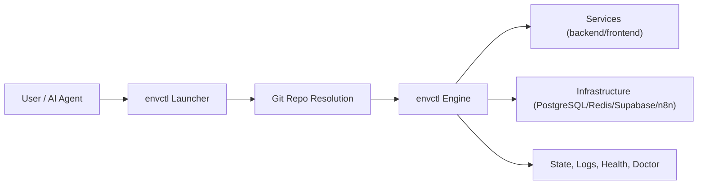

# envctl

`envctl` is a global CLI for spinning up complete local development environments in seconds across a main repository and many worktrees.

It is built for high-throughput engineering and AI-assisted coding: run multiple implementations in parallel, test all of them, inspect differences, and iterate fast with one consistent command surface.

## Table of Contents
- [What envctl Solves](#what-envctl-solves)
- [What You Can Do with envctl](#what-you-can-do-with-envctl)
- [Important Flags](#important-flags)
- [How envctl Works](#how-envctl-works)
- [Install Globally](#install-globally)
- [Repository Detection](#repository-detection)
- [Quick Start](#quick-start)
- [Run/Test/Compare Playbooks](#runtestcompare-playbooks)
- [Command Reference](#command-reference)
- [Configuration Model](#configuration-model)
- [Configuration Reference (Grouped by Type)](#configuration-reference-grouped-by-type)
- [Optional Hooks (`.envctl.sh`)](#optional-hooks-envctlsh)
- [Troubleshooting](#troubleshooting)
- [Contributing](#contributing)
- [License](#license)

## What envctl Solves
When teams scale development with many branches, worktrees, and AI agents, environment management becomes the slow part.

Common bottlenecks:
- Different startup behavior per repo.
- Port collisions across parallel implementations.
- Manual coordination of backend, frontend, DB, Redis, and tool services.
- Hard-to-reproduce run/test loops across people and agents.

`envctl` turns this into one deterministic control plane.

## What You Can Do with envctl

### 1. Bring up full environments fast
- Start backend + frontend + infrastructure in one flow.
- Resume previous sessions without rebuilding orchestration state.
- Run in interactive mode or batch mode.

### 2. Operate many worktrees at once
- Start multiple trees in parallel.
- Keep per-tree isolation with managed ports.
- Inspect everything from one dashboard/log flow.

### 3. Run, test, and compare implementations
- Target all trees/projects/services or only a specific slice.
- Run one test command across many implementations.
- Compare failures and logs quickly.

### 4. Control infra by scope
- Main-only toggles.
- Global toggles.
- All-trees toggles.
- Tree-filter toggles for selective enablement.

### 5. Use one interface for humans and AI agents
- Same commands for local dev and agent-driven tasks.
- Non-interactive command mode for automation.
- Deterministic behavior via config + explicit flags.

## Important Flags
These are the highest-value flags for day-to-day use.

### Session and mode
| Flag | Purpose |
| --- | --- |
| `--resume` | Resume previous runtime state and session mapping quickly. |
| `--batch` | Non-interactive startup/execution. |
| `--main` | Run only main mode (skip trees). |
| `trees=true` / `trees=false` | Explicitly switch between tree mode and main mode. |
| `--doctor` | Run diagnostics and exit. |
| `--dashboard` | Show runtime dashboard and exit. |

### Targeting and scope
| Flag | Purpose |
| --- | --- |
| `--project <name>` | Target one project (repeatable). |
| `--projects <a,b>` | Target multiple projects. |
| `--service <name>` | Target one service. |
| `--all` | Target all available projects/services. |
| `--untested` | Target untested projects (tests workflow). |

### Worktree orchestration
| Flag | Purpose |
| --- | --- |
| `--plan [SELECTION]` | Create worktrees from planning selection and run them (parallel). |
| `--sequential-plan [SELECTION]` | Same as plan, but startup one-by-one. |
| `--parallel-plan [SELECTION]` | Alias for `--plan`. |
| `--setup-worktrees <FEATURE> <COUNT>` | Create many worktrees directly. |
| `--setup-worktree <FEATURE> <ITER>` | Create one specific worktree iteration. |
| `--include-existing-worktrees <a,b>` | Include existing iterations when using setup flags. |

### Performance and reliability
| Flag | Purpose |
| --- | --- |
| `--fast` | Enable fast startup caches. |
| `--refresh-cache` | Force full scan and refresh cached startup metadata. |
| `--parallel-trees` | Enable parallel tree startup workers. |
| `--parallel-trees-max <n>` | Set max worker count for parallel tree startup. |
| `--clear-port-state` | Clear saved port state when reservations get stale. |
| `--force` | Force free configured ports if needed. |

### Logs and debugging
| Flag | Purpose |
| --- | --- |
| `--logs-tail <n>` | Tail last N lines for logs command. |
| `--logs-follow` | Stream logs continuously. |
| `--logs-duration <sec>` | Limit follow duration. |
| `--debug-trace` | Enable trace logging for deep troubleshooting. |
| `--debug-trace-log <path>` | Write trace output to a custom path. |

### Main environment infra source
| Flag | Purpose |
| --- | --- |
| `--main-services-local` | Force local main infra mode. |
| `--main-services-remote` | Force remote main service mode via main env files. |
| `--seed-requirements-from-base` | Seed tree DB/Redis state from base where supported. |

## How envctl Works



## Install Globally
From this repository:

```bash
./bin/envctl install
```

Useful variants:

```bash
envctl install --shell-file ~/.zshrc
envctl install --shell-file ~/.bashrc
envctl install --dry-run
```

Uninstall:

```bash
envctl uninstall
envctl uninstall --shell-file ~/.zshrc
```

Verify:

```bash
envctl --help
envctl doctor --repo /absolute/path/to/repo
```

## Repository Detection
`envctl` resolves a valid repository root as a git repo root (`.git` directory or `.git` file).

You can run:
- From any subdirectory inside a repo (auto root detection).
- From anywhere with `--repo <path>`.

`.envctl.sh` is optional and only needed for custom hooks.

## Quick Start

### 1. Optional: add orchestration config

```bash
cp .envctl.example /path/to/your-project/.envctl
```

### 2. Define explicit services (optional)

```bash
# .envctl
ENVCTL_SERVICE_1="API Server | backend  | backend  | 8000 |      | logs/api"
ENVCTL_SERVICE_2="Web App    | frontend | frontend | 3000 | 8000 | logs/web"
```

Format:

```text
"DisplayName | DirectoryPath | ServiceType | Port | BackendPort | LogDirectory"
```

### 3. Start and operate

```bash
envctl --resume
envctl dashboard
envctl logs --all --logs-follow
envctl test --all
envctl stop-all
```

## Run/Test/Compare Playbooks

### Playbook 1: parallel implementation loop

```bash
envctl --plan
envctl dashboard
envctl logs --all --logs-follow
```

### Playbook 2: compare implementations via one test command

```bash
envctl test --all
envctl errors --all
envctl logs --all --logs-tail 300
```

### Playbook 3: tight loop on one project while AI iterates

```bash
envctl test --project api
envctl logs --project api --logs-follow
envctl restart --project api
```

### Playbook 4: control multiple repositories from one shell context

```bash
envctl --repo ~/projects/service-a --resume
envctl --repo ~/projects/service-b --resume
envctl --repo ~/projects/service-c --resume
```

## Command Reference

### Launcher commands

```text
envctl [--repo <path>] [engine args...]
envctl doctor [--repo <path>]
envctl install [--shell-file <path>] [--dry-run]
envctl uninstall [--shell-file <path>] [--dry-run]
envctl --help
```

### Runtime discovery helpers

```bash
envctl --list-commands
envctl --list-targets
```

### High-value command families
- `dashboard`
- `delete-worktree`
- `stop` / `stop-all`
- `restart`
- `test`
- `logs`
- `health`
- `errors`
- `doctor`
- `pr`
- `commit`

## Configuration Model

### Config files
- `.envctl` (recommended): declarative orchestration config.
- `.envctl.sh` (optional): shell hooks for advanced custom orchestration.

### Precedence
`envctl` applies configuration in this order:
1. Existing shell environment variables.
2. `.envctl` / `.envctl.sh`.
3. Engine defaults.

### `.envctl` vs `.env`
- `.envctl` controls orchestration behavior.
- `.env` controls application runtime env vars/secrets.

Keep them separate for predictable startup and safer secret handling.

## Configuration Reference (Grouped by Type)

### Core
| Variable | Default | Purpose |
| --- | --- | --- |
| `ENVCTL_SKIP_DEFAULT_INFRASTRUCTURE` | `false` | Global skip for built-in PostgreSQL and Redis startup. |
| `ENVCTL_CONFIG_FILE` | unset | Explicit path to config file. |

### Database (PostgreSQL and Supabase)
Supabase includes PostgreSQL, so treat them as alternative stacks per scope.

| Variable | Default | Purpose |
| --- | --- | --- |
| `POSTGRES_MAIN_ENABLE` | `true` | Enable PostgreSQL for Main mode. |
| `DB_PORT` | `5432` | PostgreSQL base port. |
| `DB_USER` | `postgres` | PostgreSQL user. |
| `DB_PASSWORD` | `postgres` | PostgreSQL password. |
| `DB_NAME` | `postgres` | PostgreSQL DB name. |
| `SUPABASE_MAIN_ENABLE` | `false` | Enable Supabase stack for Main mode. |
| `SUPABASE_ALL_TREES` | `false` | Enable Supabase stack for all trees. |
| `SUPABASE_TREE_FILTER` | empty | Comma-separated features that should use Supabase. |

### Redis
| Variable | Default | Purpose |
| --- | --- | --- |
| `REDIS_ENABLE` | `true` | Global Redis switch (Main + Trees). |
| `REDIS_MAIN_ENABLE` | `true` | Redis switch for Main mode. |
| `REDIS_ALL_TREES` | `true` | Enable Redis in all tree workspaces. |
| `REDIS_TREE_FILTER` | empty | Comma-separated features that should use Redis. |
| `REDIS_PORT` | `6379` | Redis base port. |

### n8n
| Variable | Default | Purpose |
| --- | --- | --- |
| `N8N_ENABLE` | `true` | Global n8n switch (Main + Trees). |
| `N8N_MAIN_ENABLE` | `false` | Enable n8n for Main mode. |
| `N8N_ALL_TREES` | `false` | Enable n8n for all trees. |
| `N8N_TREE_FILTER` | empty | Comma-separated features that should use n8n. |
| `N8N_PORT_BASE` | `5678` | n8n base port. |

### Backend
| Variable | Default | Purpose |
| --- | --- | --- |
| `RUN_BACKEND` | `true` | Enable backend auto-discovery. |
| `BACKEND_DIR_NAME` | `backend` | Preferred backend directory name. |
| `BACKEND_PORT_BASE` | `8000` | Backend base port for allocation. |

### Frontend
| Variable | Default | Purpose |
| --- | --- | --- |
| `RUN_FRONTEND` | `true` | Enable frontend auto-discovery. |
| `FRONTEND_DIR_NAME` | `frontend` | Preferred frontend directory name. |
| `FRONTEND_PORT_BASE` | `9000` | Frontend base port for allocation. |

### Explicit Services
| Variable | Default | Purpose |
| --- | --- | --- |
| `ENVCTL_SERVICE_<N>` | empty | Declared service list. If present, auto-discovery is disabled. |

## Optional Hooks (`.envctl.sh`)
Use this only when declarative config is not enough.

Available hooks:
- `envctl_define_services`
- `envctl_setup_infrastructure`

Example:

```bash
# .envctl.sh
envctl_setup_infrastructure() {
  echo "Custom infra bootstrap"
}

envctl_define_services() {
  start_service_with_retry "API" "$BASE_DIR/backend" "backend" "8000" "" "$LOGS_DIR/api"
  start_service_with_retry "Web" "$BASE_DIR/frontend" "frontend" "3000" "8000" "$LOGS_DIR/web"
}
```

## Troubleshooting

### "Could not resolve repository root"
- Ensure the path is a git repository root (`.git` dir or file).
- Or pass `--repo /absolute/path`.

### Port collisions or stale state
- Run `envctl --doctor`.
- Use `envctl --clear-port-state` when needed.
- Adjust base ports in `.envctl`.

### Unexpected services started
- If `ENVCTL_SERVICE_<N>` exists, auto-discovery is disabled.
- Remove/fix explicit service entries.

### Infra not starting as expected
Verify toggles for:
- `ENVCTL_SKIP_DEFAULT_INFRASTRUCTURE`
- PostgreSQL/Supabase toggles
- `REDIS_*`
- `N8N_*`

## Contributing
Contributions are welcome.

Recommended workflow:
1. Create a branch from `main`.
2. Keep changes scoped to one objective (launcher, infra, docs, tests, etc.).
3. Run validation locally:
```bash
bats tests/bats/*.bats
```
4. Use conventional commits (`type(scope): subject`).
5. Open a PR with a concise `Summary`, a `Validation` section with exact commands/results, and a short `Impact` note.

---

`envctl` is a development control plane for high-speed iteration: bring up full environments quickly, run many worktrees in parallel, and compare implementations with one consistent CLI.
