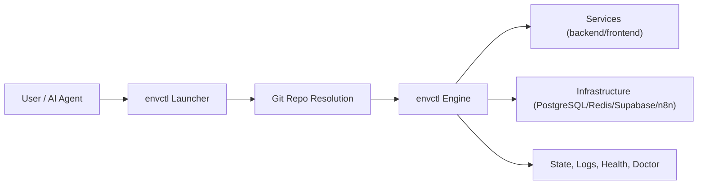

# Architecture

`envctl` is split into a launcher and an engine.

- Launcher: resolves repo context, installs PATH entry, forwards commands.
- Engine: runs orchestration for services, infrastructure, logs, state, health, and diagnostics.

## Determinism
Determinism comes from:
- Consistent CLI entrypoint (`envctl`).
- Explicit mode/target flags.
- Config precedence (`env > .envctl/.envctl.sh > defaults`).
- Saved runtime state with resume flows.
